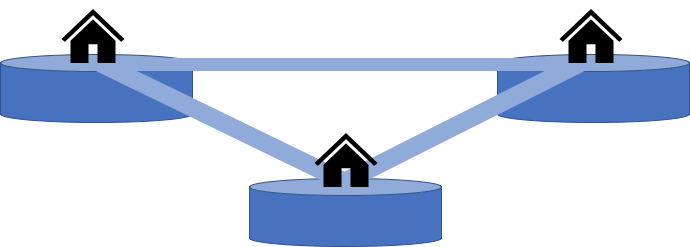
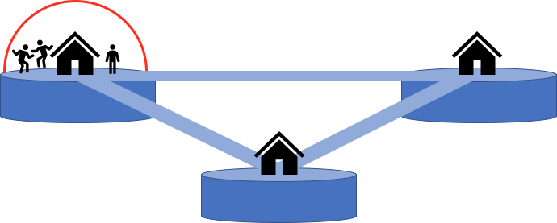
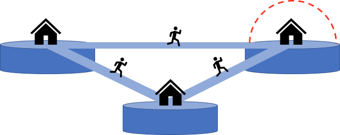
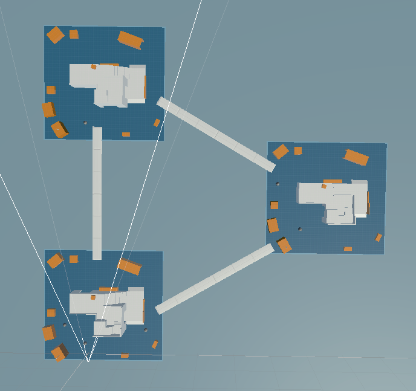

# 软工方案：第三人称射击动作网络游戏

\*全篇都是初步构想，**不是最终策划**！有任何新想法和新方案有劳大家随时提出。

### Demo下载

支持[Windows X86_64](https://github.com/SprLau/TPS/releases/download/v1.0/TPS_Demo_x86_64.exe)

支持[MacOS]()

***[关于Demo](### 关于Demo)***

## 游戏概况

* 第三人称射击动作网络游戏（TPS Online Game）
* 生存游戏（即胜利条件为所有敌对单位出局）
* 五局三胜制，每一局游戏时长估计为5-10分钟
* 2或4玩家，支持单机（添加电脑Bot）和线上游戏
* 游戏平台：PC端跨平台（Windows与MacOS）
* 游戏引擎：Unity3D
* 游戏主要语言：C#
  * 游戏操作逻辑实现、游戏网络同步实现（祯同步？）、电脑Bot行为实现
* 额外工作：后端数据库（Django？）、游戏官方网站（React？）等

## 核心策划

### 游戏内容设计

游戏对战模式为单挑混战或者2VS2（仅在4人参赛下生效）。

游戏内主要场景由三块区域相互通过道路连接组成，简化为下图（正式制作时具体为Unity资源库中的[PolyArt](https://tse1-mm.cn.bing.net/th/id/R-C.cdefd16fdbfe6d05c9df8176287530af?rik=VZbjZxOODzMuHQ&riu=http%3a%2f%2fabduzeedo.com%2fsites%2fdefault%2ffiles%2fstyles%2fhome_cover%2fpublic%2foriginals%2fbreaking_bad_low_poly_by_error_23-d73ouop.png%3fitok%3deAn4A2Ub&ehk=FLorztsoaWZK8DmLIP3acaR%2bObZG8iKDyKyKeKFDL2Y%3d&risl=&pid=ImgRaw&r=0)细节场景）。每块区域中有一个“道具屋”，在其中会定时不间断提供武器、防具和治疗。

1. 游戏开始后，玩家会同时随机出生在三块区域中的任意一个，并在此时出现屏障罩住玩家所在的区域。

   > 

2. 在**规定倒计时**内，玩家不得离开屏障；为了获胜，玩家需要尽可能留在屏障内并且避免伤害，同时迫使敌对单位离开屏障出局或者对其造成伤害。

3. **倒计时结束**后，屏障会消失一段时间，在这个间隙，玩家可以控制角色在区域间穿梭移动，并在此期间所受伤害大幅减免；游戏会提示玩家下一个屏障出现的区域。

   随后，屏障重新出现，倒计时重新开始，且屏障所罩面积较上次减小，倒计时时间也会逐次缩减，使得玩家更容易失误越过屏障而出局，让生存下去的难度变大。如果玩家没有在倒计时开始前及时赶到下一个屏障，则直接出局。

   > 

4. 重复第2步和第3步，直至游戏最后仅剩一个势力单位。

### 游戏规则

出局条件：在屏障产生时离开屏障 **或** 生命值降为0。

获胜条件：游戏最后仅自己及友方单位幸存。

### 角色设计

初步设定2个可选角色，每个角色仅外观和技能（P.s. 技能名就是说不得不中二一点）不同：

#### 角色 I —— Knight

* 初始武器：步枪（中等伤害效果。打击一个敌方单位，对其造成中等伤害，攻速中等）
* 技能：“不动如山”。开启技能后产生霸体，对任何控制效果免疫一段时间，并且防御力大幅增加。

#### 角色2 —— Priest

* 初始武器：十字弩（持续伤害效果。打击一个敌方单位，使其中毒造成持续伤害；治疗一个友方单位，为其恢复少量生命。攻速中等）
* 技能：“兼爱非攻”。开启技能后为自己和友方单位恢复大量生命值，并指定一名敌方单位使其瘫痪，在一段时间里剥夺其技能能力。

### 道具设计

原子能枪：范围控制效果。较大距离击退范围内的敌方单位，攻速较慢。

冲锋枪：高速伤害效果。打击一个敌方单位，对其造成小幅伤害，攻速很快。

霰弹枪：范围伤害效果。打击范围敌方单位，对其造成大幅伤害，攻速中等。

防弹衣：为自己大幅增强防御力。

避震鞋：为自己减免敌方控制效果。

刺客鞋：获得一个主动技能“死亡尾流”。触发后朝前方瞬移一段距离，并在身后留下一条尾流，秒杀任何触碰到该尾流的敌方单位。出现概率很低。

践踏鞋：获得一个主动技能“开天裂地”。触发后对地面猛烈一击，远距离震飞周围的敌方单位。出现概率很低。

急救包：为自己巨幅回复生命值。

### 关于Demo

游戏的基本核心功能以及物理已经实现，WSAD前后左右，左shift冲刺，左ctrl蹲，空格跳，鼠标左键开枪，右键瞄准。

还有很多不是那么核心的地方没做，比如没有给武器建模和下蹲动作诡异等。不过也不是有致命影响的大问题，如果之后要继续做下去的话就在这个Demo基础上增量开发就行。另外现在的地图是这样的：

